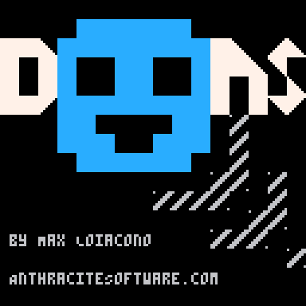
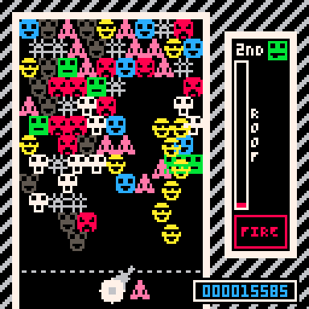
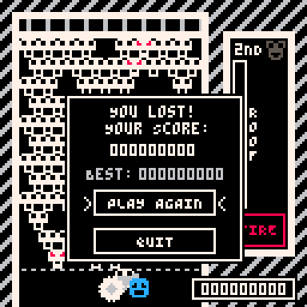
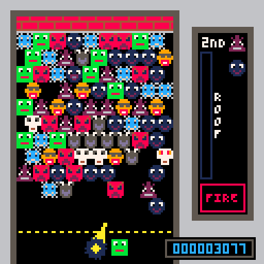

# DOONS

DOONS is a match-3 bubble shooter game for the Pico-8 platform.
Builds are published for Pico-8, Windows, Mac, Linux, and HTML5 platforms.
The source code, art assets, and compiled artifacts are licensed under the [CC BY-NC-SA 4.0 License](https://creativecommons.org/licenses/by-nc-sa/4.0/).

## Manual

DOONS supports keyboard, controller, touch, and mouse controls and is fully playable with any option.

The goal is to shoot DOONS, create matches of 3 or more thus clearing the DOONS, ultimately clearing the board.
DOONS cannot float; if you isolate a group of DOONS they will all fall. You are scored significantly more for
dropping larger sets of DOONS at once. Your score is displayed in the lower right corner.

The "ROOF" meter fills up based on your difficulty level. When this reaches the top, the roof and all DOONS drop.
If any DOON crosses the dotted threshold towards the bottom, you lose. The "ROOF" meter drains when you drop DOONS
(based on difficulty level as well).

In the "BRUTAL" difficulties, DOONS are shot automatically and you need to time things properly.
The speed of the shooter is also increased to better support keyboard/controller devices in this mode. Zen mode offers a no-stress time killer experience; the roof won't drop at all.

### Controls

* Left/Right: turn shooter left/right
* Down (in-game): Pause menu
* Primary (Pico-8: (o); Keyboard: z): Shoot
* Hold Secondary (Pico-8: (x); Keyboard: x): Turn shooter slower

* Alt+Enter (Desktop builds): Fullscreen

### Config

DOONS allows you to configure the following options:

* Swapping primary/secondary buttons
* Changing the animation speed.
* Changing the art theme

## AI Disclosure

GenAI was not used for any portion of this game.
